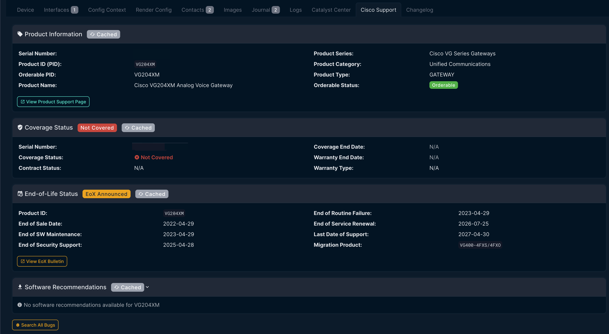

# NetBox Cisco Support Plugin

A NetBox plugin that displays Cisco Support information for devices, including:
- **Product Information** - Product name, series, category, and orderable status
- **End-of-Life (EoX)** - Key lifecycle dates with migration recommendations
- **Security Advisories (PSIRT)** - Cisco security advisories affecting the product
- **Known Bugs** - Critical bugs (severity 1-3) from Cisco Bug Search
- **Software Recommendations** - Suggested software releases

## Features

- **Serial Number Based** - Tab only appears on devices with a valid serial number
- **Manufacturer Filtering** - Configurable pattern to match Cisco manufacturers
- **Direct Cisco API Integration** - Uses Cisco Support APIs with OAuth2 authentication
- **Caching** - API responses are cached to reduce load and improve performance
- **Visual Status Indicators** - Color-coded badges for EoX dates and advisory severity

## Requirements

- NetBox 4.0.0 or higher
- Python 3.10 or higher
- Cisco API credentials (from [Cisco API Console](https://apidocs-prod.cisco.com/))

## Installation

### Via pip (recommended)

```bash
pip install netbox-cisco-support-api
```

### From source

```bash
git clone https://github.com/sieteunoseis/netbox-cisco-support.git
cd netbox-cisco-support
pip install .
```

## Configuration

Add the plugin to your NetBox `configuration.py`:

```python
PLUGINS = [
    'netbox_cisco_support',
]

PLUGINS_CONFIG = {
    'netbox_cisco_support': {
        # Required: Cisco API credentials
        'cisco_client_id': 'your-client-id',
        'cisco_client_secret': 'your-client-secret',

        # Optional: Manufacturer matching pattern (regex, case-insensitive)
        # Default: r'cisco'
        'manufacturer_pattern': r'cisco',

        # Optional: API request timeout in seconds
        'timeout': 30,

        # Optional: Cache duration for API responses in seconds
        'cache_timeout': 300,
    }
}
```

Restart NetBox after making configuration changes.

## Getting Cisco API Credentials

1. Go to [Cisco API Console](https://apidocs-prod.cisco.com/)
2. Sign in with your Cisco CCO ID
3. Register a new application
4. Request access to the following APIs:
   - Product Information API
   - End of Life (EoX) API
   - Bug API
   - PSIRT (Security Advisory) API
   - Software Suggestion API
5. Copy your Client ID and Client Secret

## Usage

Once configured, the "Cisco Support" tab will automatically appear on device detail pages that meet these requirements:

1. Device has a **serial number** assigned
2. Device manufacturer matches the `manufacturer_pattern` (default: "cisco")

The tab displays:
- Product information from the serial number lookup
- End-of-Life status with key dates
- Security advisories affecting the product
- Known bugs (severity 1-3)
- Software recommendations

## Screenshots

### Device Cisco Support Tab


## Development

### Setup

```bash
git clone https://github.com/sieteunoseis/netbox-cisco-support.git
cd netbox-cisco-support
pip install -e .
```

### Code Quality

```bash
# Format code
black netbox_cisco_support/
isort netbox_cisco_support/

# Lint
flake8 netbox_cisco_support/
```

## License

Apache License 2.0 - See [LICENSE](LICENSE) for details.

## Author

Jeremy Worden ([@sieteunoseis](https://github.com/sieteunoseis))

## Links

- [GitHub Repository](https://github.com/sieteunoseis/netbox-cisco-support)
- [PyPI Package](https://pypi.org/project/netbox-cisco-support/)
- [Cisco Support APIs](https://developer.cisco.com/docs/support-apis/)
